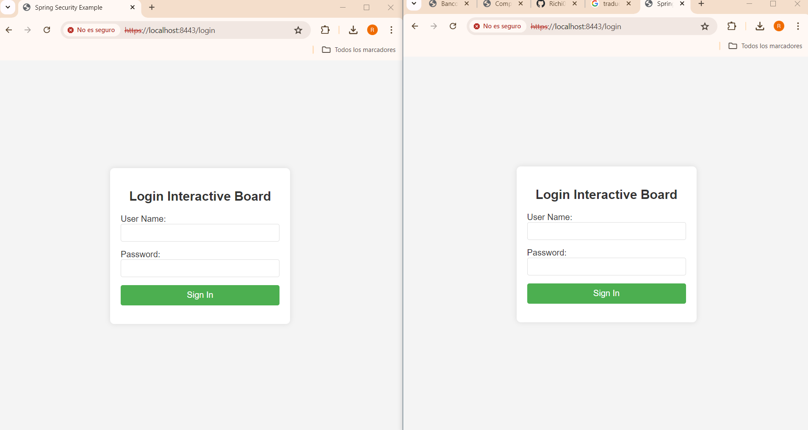

# InteractiveBlackBoard

This application is an interactive web-based whiteboard that allows multiple users to draw simultaneously on a shared canvas through a real-time connection using WebSocket technology.

### Features
+ **Draw**: You can draw consecutive circles using the mouse click.


## Starting

In order to use the project on your system, you can access the following link and download a compressed file of it.

[Repository](https://github.com/Richi025/Interactiveblackboard.git) 

You can also clone the file using the following command.

```
git clone https://github.com/Richi025/Interactiveblackboard.git 
```

### Previous requirements

It is necessary to have "**Maven**", "**Java**", installed, preferably in their latest versions.

#### Maven
```
Download Maven at http://maven.apache.org/download.html 

Follow the instructions at http://maven.apache.org/download.html#Installation
```
#### Java

```
Download Java at https://www.java.com/es/download/ie_manual.jsp
```

### Installing

Once you have the cloned project in your repository. Follow the steps below to launch the program successfully.

#### Run BackEnd Spring-boot and Run FrontEnd React Js

1. Open a terminal and enter the folder where I clone the repository and enter the BoardSpring folder.

2. Use the following command to compile and clean the target directory.
    ```
    mvn clean compile
    ```
3. Now use the following command to package the project as a JAR file.

    ```
    mvn package
    ```

4. Now you can run the project using the following command.

    ```
    mvn spring-boot:run

    Now the server is running.
    ```

4. Now there will be a browser and enter the following link and you can start drawing.

    http://localhost:8080/ 

    

## Deployment in AWS

Start a browser and you will enter the following link and you can start drawing.

http://ec2-54-159-22-152.compute-1.amazonaws.com:8080 

 

## Proyect Structure

### Summary of Functionality

### 1. Spring Boot Server:

+ Configures and launches a WebSocket and REST server.
+ Provides a /bbService endpoint for WebSocket.
+ Provides a /status endpoint to check the server status.

### 2. WebSocket:

+ BBEndpoint handles WebSocket communication: opens connections, processes messages, and manages errors.
+ Received messages are broadcast to all connected clients, except the one that sent the message.

### 3. Web Client (HTML + React + P5.js):

+ The HTML page loads React, P5.js, and the bbComponents.jsx component.
+ bbComponents.jsx defines the React components that manage the canvas and WebSocket communication.
+ Users can draw on the canvas, and the points are sent to the WebSocket server.
+ Points received from the server are drawn on the canvas of all connected clients.

## Architectural Design


### Component Explanation

**Java Packages (`co.edu.escuelaing.interactiveblackboard`):**

- **BBConfigurator.java:** Configures a `ServerEndpointExporter` bean in Spring to enable WebSocket endpoints.
- **BBEndpoint.java:** Specifies the WebSocket server endpoint (`/bbService`) using the `@ServerEndpoint` annotation. Handles WebSocket connections, sending and receiving messages.
- **DrawingServiceController.java:** REST controller defining an endpoint (`/status`) to check the server's status.

**Spring Boot Application:**

- **InteractiveblackboardApplication.java:** Entry point of the Spring Boot application. Configures and runs the Spring Boot application, specifying the port using the `getPort()` method and configuration files in `application.properties`.

**Static Resources:**

- **js/bbComponents.jsx:** JavaScript file containing React components for the user interface. Uses P5.js to draw on an HTML5 canvas and WebSocket for real-time communication with the server.

**Static Files:**

- **index.html:** Main HTML page of the web application. Loads React, P5.js, and babel to transpile JSX to JavaScript.

**Configuration File:**

- **pom.xml:** Maven configuration file defining project dependencies, including Spring Boot and necessary libraries for React and WebSocket.


### Data Flow:

 + **WebSocket Connection:** The client establishes a WebSocket connection with the server.
+ **Drawing Data (x, y):** When a user draws on the canvas, the position data (x, y) is sent to the server via WebSocket.
+ **Broadcasting Data:** The server broadcasts this data to all other connected clients, updating their canvases in real-time.
+ **Acknowledgment / Error Handling:** The server may send acknowledgments or handle errors as needed during data transmission.

## Built with

* [Maven](https://maven.apache.org/) - Dependency management
* [java](https://www.java.com/es/) - Programming language
* [Spring boot](https://start.spring.io/) - Framework

### Technologies Used
+ **Java:** Programming language.
+ **Spring Boot:** Framework for building the application.
+ **React:** Is an open source Javascript library designed for creating user interfaces.
+ **P5:** Creative JavaScript library for drawing graphics and animations in the web browser.

## Versioned

We use [Git](https://github.com/) for version control. For available versions, see the tags in this repository.

## Authors

* **Jose Ricardo Vasquez Vega** - [Richi025](https://github.com/Richi025)

## Date

Tuesday, July 09, 2024

## License

This project is licensed under the GNU license; See the [LICENSE.txt](LICENSE.txt) file for details.